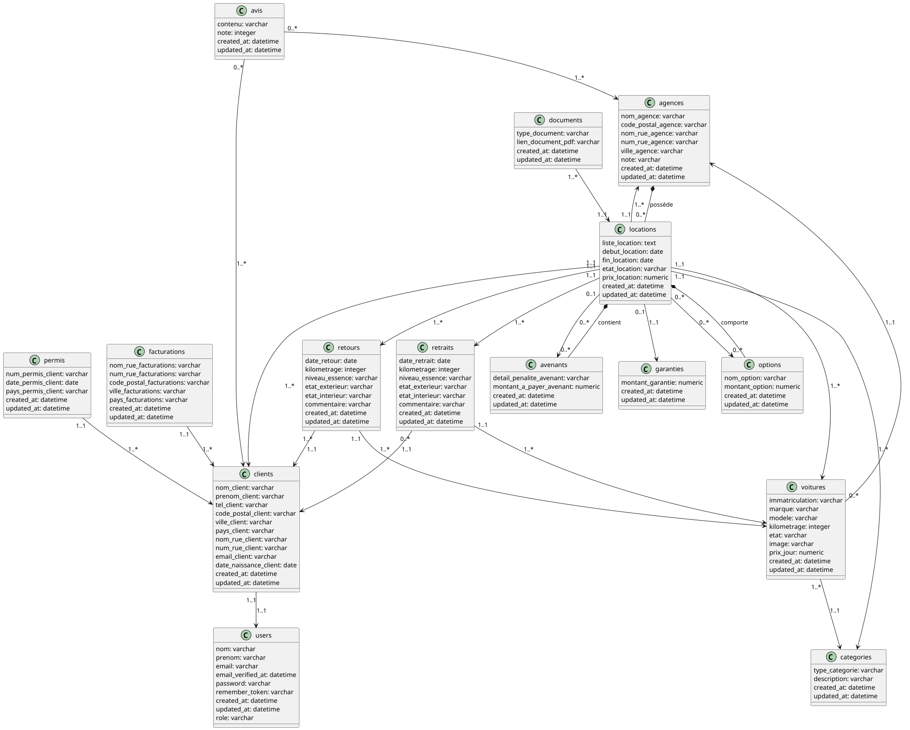

## 🚀 Comment faire pour lancer l'application

1. Installer les dépendances avec `composer install`
```bash
composer install
```

2. Créer le fichier .env.example .env
```bash
cp .env.example .env
```

3. Générer la clé d'application
```bash
php artisan key:generate
```

4. Créer les tables
- La première fois :
```bash
php artisan migrate
```
- Sinon :
```bash
php artisan migrate:fresh
```

5. Ajouter des données de test
```bash
php artisan db:seed
```

6. Ajouter la librairie dompdf pour le traitement des fichiers et la librairie scramble pour la documentation des routes en ligne accessible à l'adresse http://localhost:8000/docs/api
```bash
composer require dompdf/dompdf
composer require dedoc/scramble
```

7. Installer duster pour le linting
```bash
composer require tightenco/duster --dev
```  

Pour lancer le linting voici la commande : 
```bash
./vendor/bin/duster lint
```

8. Lancer mailpit
```bash
mailpit
```

9. Lancer le serveur
```bash
php artisan serve
```

## 🛠️ Autre méthode de lancement

### Vous pouvez lancer l'application avec docker en mode développement
```bash
docker build -t laravel-dev --target=dev .
docker run -p 8000:8000 -p 8025:8025 laravel-dev
```

### Vous pouvez également lancer l'application avec docker en mode production
```bash
docker build -t laravel-prod --target=prod .
docker run -p 8000:80 laravel-prod
```

## 🧾 Répartition des tâches

| Tâches                              | Responsable(s)                                                       |
|-------------------------------------|----------------------------------------------------------------------|
| Configuration des migrations        | Morel Mathias                                                        |
| Création des seeders                | Cornet Benjamin / Caillieret Simon                                   |
| Création des factories              | Morel Mathias                                                        |
| Création des ressources             | Morel Mathias                                                        |
| Gestion des relations entre modèles | Dalmasso Mathéo / Cornet Benjamin                                    |
| Développement des contrôleurs       | Dalmasso Mathéo / Cornet Benjamin / Morel Mathias / Caillieret Simon |
| Gestion des mails / pdf             | Cornet Benjamin                                                      |
| Création des requests               | Cornet Benjamin                                                      |
| Création des modèles                | Cornet Benjamin / Dalmasso Mathéo                                    |
| Mise en place des rôles             | Cornet Benjamin                                                      |
| Création des repository             | Cornet Benjamin / Morel Mathias                                      |
| Création des routes                 | Cornet Benjamin / Morel Mathias / Dalmasso Mathéo / Caillieret Simon |
| Création du readme                  | Morel Mathias / Dalmasso Mathéo                                      |
| Création de test API (insomnia)     | Morel Mathias / Cornet Benjamin / Dalmasso Mathéo                    |
| Création de l'énumeration           | Cornet Benjamin                                                      |

## 🧠 Auto-évaluation du groupe

Dans l’ensemble, nous sommes satisfaits du travail accompli sur ce projet d’API Laravel. La répartition des tâches a été équilibrée, chaque membre a participé activement à la construction de l’application. Nous avons respecté les conventions du framework Laravel, en utilisant des patterns reconnus comme le Repository, et en exploitant des outils comme DomPDF pour la génération de PDF ou Mailpit pour les tests d’envoi d’emails.

## ✅ Points positifs :
- Bonne communication au sein de l’équipe.
- Utilisation rigoureuse de Gitlab pour le versioning.
- Application fonctionnelle.
- Tests API réalisés avec Insomnia.

## ❌ Points à améliorer :
- Nous aurions pu mieux organiser nos fichiers, certaines méthodes auraient pu être placées dans des fichiers séparés.
- Des méthodes ont dû être modifiées ou ajoutées lors du développement du client Angular.
  Nous aurions pu anticiper ces besoins dès le développement de l’API.

## 📝 Bilan :
Ce projet nous a permis de renforcer nos compétences en Laravel et en gestion de projet. Nous avons mis en pratique nos connaissances acquises en cours lors des ressources Complément Web et Développement Web. Nous avons également appris à travailler en équipe et à gérer les conflits.

## 📊 Diagramme de classe


## 📘 Dictionnaire de données

| Code  | Type | Contrainte   | Description |
|-------|-----------|-------|-----------------|
| idPermis       |  int          |  not null     | Identifiant du permis                |
| date_permis_client      | date          |  not null     |  Date de l'obtention du permis               |
| pays_permis_client      |  varchar          |    not null   |  Pays de l'obtention du permis              |
|       |           |       |                 |
|  idFacturation     |  int          | not null       | Identifiant de la facturation                |
| nom_rue_facturation       |  varchar         | not null      | Nom de la rue de la facturation                |
| num_rue_facturation       |  varchar         | not null      | Numero de la rue de la facturation                |
| code_postal_facturation       |  varchar         | not null      | Code postal de la facturation                |
| ville_facturation       |  varchar         | not null      | Ville de la facturation                |
| pays_facturation       |  varchar         | not null      | Pays de la facturation                |
|       |           |       |                 |
| idClient      |  int         |  not null     |  Identifiant du client               |
| nom_client      |  varchar         |  not null     |  Nom du client               |
|  prenom_client      |  varchar         |  not null     |  Prenom du client               |
|   tel_client      |  varchar         |  not null     |  Telephone du client               |
|    nom_client      |  varchar         |  not null     |  Nom du client               |
| code_postal_client      |  varchar         |  not null     |  Code postal du client               |
| ville_client      |  varchar         |  not null     |  Ville du client               |
| pays_client      |  varchar         |  not null     |  Pays du client               |
| nom_rue_client      |  varchar         |  not null     |  Nom rue du client               |
| num_rue_client      |  varchar         |  not null     |  Numero de la rue du client               |
| email_client      |  varchar         |  not null     |  Email du client               |
| date_naissance_client      |  date         |  not null     |  Date de naissance du client               |
|       |           |       |                 |
|  idUser     |  int         | not null      |   Identifiant du user              |
|  nom     |  varchar         | not null      |   Nom du user              |
|  prenom     |  varchar         | not null      |   Prenom du user              |
|  email     |  varchar         | not null      |   Email du  user              |
|  email_verified_at     |  datetime         | not null      |   Verification du mail du user              |
|  password     |  varchar         | not null      |   Password du user              |
|  remember_token     |  varchar         | not null      |   Remember du token du user              |
|  role     |  varchar         | not null      |   Role du user              |
|       |           |       |                 |
| idRetour      |  int         | not null      | Identifiant du retour                |
| date_retour      |  date         | not null      | Date du retour                |
| kilometrage      |  int         | not null      | Kilometrage de la voiture                |
| niveau_essence      |  varchar         | not null      | Niveau d'essence de la voiture                |
| etat_exterieur      |  varchar         | not null      | Etat exterieur de la voiture              |
| etat_interieur      |  varchar         | not null      | Etat interieur de la voiture                |
| commentaire      |  varchar         | not null      | Commentaire sur la voiture                |
|       |           |       |                 |
| idRetrait      |  int         | not null      | Identifiant du retrait                |
| date_retrait      |  date         | not null      | Date du retrait               |
| kilometrage      |  int         | not null      | Kilometrage de la voiture                |
| niveau_essence      |  varchar         | not null      | Niveau d'essence de la voiture                |
| etat_exterieur      |  varchar         | not null      | Etat exterieur de la voiture              |
| etat_interieur      |  varchar         | not null      | Etat interieur de la voiture                |
| commentaire      |  varchar         | not null      | Commentaire sur la voiture                |
|       |           |       |                 |
| idAvis      |   int        |  not null     |   Identifiant de l'avis              |
| contenu      |    varchar       |   not null    |  Contenu de l'avis                |
| note      |   int        |  note null + 0 < note < 5     |  Note de l'agence               |
|   |        |       |                |
| idGarantie      |   int        |  note null   |  Identifiant de la garantie               |
| montant_garantie      |   float        |  note null   |  Montant de la garantie              |
|       |           |     |                 |
| idCategorie      |   int        |  note null   |  Identifiant de la catégorie             |
| description      |   varchar        |  note null   |  Description de la catégorie             |
|       |           |       |                 |
| idLocation      | int          | not null      | Identifiant d'une location                |
| liste_location      | varchar          | not null      | Liste des options d'une location                |
| debut_location      | date          | not null + debut_location < fin_location      | Date de début d'une location                |
| fin_location      | date          | not null + fin_location > debut_location      | Date de fin d'une location                |
| etat_location      | varchar          | not null      | Définit l'état d'une réservation                |
| prix_location      | float          | not null + (somme de toutes les options + prix de voiture)    | Prix d'une réservation                |
|       |           |       |                 |
| idDocument      | int          | not null      | Identifiant d'un document                |
| lien_document_pdf      | varchar          | not null      | Lien d'où est stocké le document                |
|       |           |       |                 |
| idAgence      | int          | not null      | Identifiant de l'agence                |
| nom_agence      | varchar          | not null      | Nom d'une agence                |
| code_postal_agence      | varchar          | not null      | Code postal de l'agence                |
| nom_rue_agence      | varchar          | not null      | Nom de la rue de l'agence                |
| num_rue_agence      | varchar          | not null      | Numéro de rue de l'agence                |
| ville_agence      | varchar          | not null      | Ville de l'agence                |
| note      | int          | not null + 0 < note < 5      | Note attribuée à l'agence                |
|       |           |       |                 |
| idVoiture      | int          | not null      | Identifiant de la voiture                |
| immatriculation      | varchar          | not null     | Plaque d'immatriculation de la voiture                |
| marque      | varchar          | not null      | Marque de la voiture                |
| modele      | varchar          | not null      | Modele de la voiture                |
| kilometrage      | int          | not null      | Nombre de kilometres au compteur de la voiture                |
| etat      | varchar          | not null      | Etat de la voiture                |
| image      | varchar          | not null      | Lien vers l'image de la voiture                |
|       |           |       |                 |
| idOption      | int          | not null      | Identifiant de l'option                |
| nom_option      | varchar          | not null      | Nom de l'option                |
| montant_option      | float          | not null      | Montant de l'option                |
|       |           |       |                 |
| idAvenant      | int          | not null      | Identifiant de l'avenant                |
| detail_penalite_avenant      | varchar          | not null      | Detail de l'avenant                | 
| montant_a_payer_avenant      | float          | not null      | Montant de la pénalité                | 
