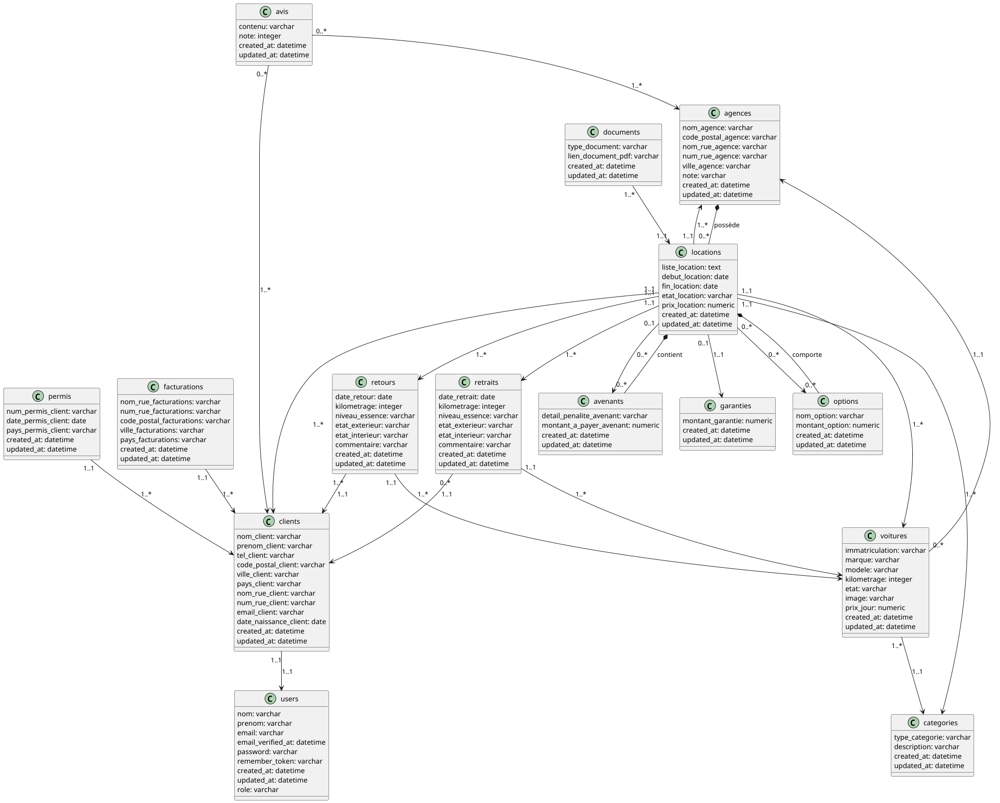

## 🚀 Comment lancer notre application

### 1. Il faut d'abord lancer le serveur API de laravel , pour ce faire suivez les étapes suivantes (à faire sur l'application de l'API) :

1. Installer les dépendances avec `composer install`
```bash
composer install
```

2. Créer le fichier .env.example .env
```bash
cp .env.example .env
```

3. Générer la clé d'application
```bash
php artisan key:generate
```

4. Créer les tables
```bash
php artisan migrate
```

5. Ajouter des données de test
```bash
php artisan db:seed
```

6. Ajouter dompdf pour le traitement des fichiers
```bash
composer require dompdf/dompdf
```

7. Installer duster pour le linting
```bash
composer require tightenco/duster --dev
```

8. Lancer mailpit
```bash
mailpit
```

9. Lancer le serveur API
```bash
php artisan serve
```

## 🛠️ Autre méthode de lancement

### Vous pouvez lancer l'application avec docker en mode développement
```bash
docker build -t laravel-dev --target=dev .
docker run -p 8000:8000 -p 8025:8025 laravel-dev
```

### Vous pouvez également lancer l'application avec docker en mode production
```bash
docker build -t laravel-prod --target=prod .
docker run -p 8000:80 laravel-prod
```

### 2. Lancer le serveur de l'application front-end

1. Installer les dépendances avec `npm install`
```bash
npm install
npm install i18n-iso-countries
npm install countries-list
npm install emaijs-com
```

2. Lancer le serveur
```bash
ng s
```

## Autre méthode de lancement

### Vous pouvez lancer l'application avec docker en mode développement
```bash
docker build -t angular-dev --target=dev .
docker run -p 4200:4200 angular-dev
```

### Vous pouvez également lancer l'application avec docker en mode production
```bash
docker build -t angular-prod --target=nginx-prod .
docker run -d -p 8001:80 angular-prod
```

Vous pouvez maintenant accéder à l'application via l'adresse IP de la machine : 8001

## Comment tester notre application

Une fois que le serveur back-end et le serveur front-end sont lancés, vous pouvez accéder à l'application.

Guide d'utilisation de l'application :

Lorsque vous lancez l'application, vous trouverez une page d'accueil contenant un bouton "Connexion" et un bouton "Inscription" dans la barre de navivigation.
Vous avez une barre de recherche qui vous permet de rechercher un modèle de voiture, ensuite vous avez une section avec nos différentes catégories de voitures que l'on propose avec un système de carroussel.
Vous avez également une section ou l'on a mis trois boxs : 
- La première box, si vous appuyez sur le bouton "S'inscrire" vous serez redirigé vers la page d'inscription.
- La deuxième box, si vous appuyez sur le bouton "Réserver maintenant" vous serez redirigé vers la page de réservation (si vous voulez faire une réservation sans être connecté, un formulaire d'inscription s'affichera pour vous inscrire lors des différentes étapes de la création de la réservation).
- La troisième box, si vous appuyez sur le bouton "En savoir plus" vous serez redirigé vers la page de la présentation de l'entreprise, l'équipe et les valeurs de l'entreprise.

Ensuite vous avez une section qui représente le footer de l'application avec, notamment, des liens qui permettent de rediriger vers les réseaux sociaux de l'entreprise (Facebook, Instagram et Twitter), les différentes navigations possibles selon si oui ou non vous êtes connectés et vous avez également nos coordonnées.

Pour vous connecter à l'application, vous pouvez vous connecter avec un compte en appuyant sur le bouton "Connexion" si vous en avez un sinon vous pouvez vous inscrire avec le bouton "Inscription".

Si vous voulez vous connecter avec un rôle Admin vous pouvez utiliser les identifiants suivants :
- email : robert.duchmol@domain.fr
- mot de passe : GrosSecret123

Si vous voulez vous connecter avec un rôle Agent vous pouvez utiliser les identifiants suivants :
- email : morel.mathias@domain.fr
- mot de passe : GrosSecret2

Autre compte Agent :
- email : cornet.benjamin@domain.fr
- mot de passe : GrosSecret3

## 👥 Les différentes fonctionnalités en fonction de votre rôle :
### Admin :
- Vous avez tous les droits sur l'application.
### Agent :
- Vous avez accès à la liste des clients.
- Vous avez accès à la liste des réservations.
- Vous avez accès à la liste des voitures.
- Vous avez accès à la page contact.
- Vous pouvez faire un retour sur une réservation.
- Vous pouvez faire un retrait sur une réservation.
- Vous pouvez changer l'état d'une voiture.
- Vous avez accès à la liste des agences.
- Vous avez accès à la liste des voitures selon l'agence.
- Vous pouvez voir les détails d'une voiture dans l'agence.
- Vous pouvez voir la liste des réservations.
- Vous pouvez annuler une réservation.
- Vous avez accès à votre profil qui affiche votre nom, prénom et email.
### Client :
  - Vous pouvez voir votre profil qui affiche vos informations (User) votre nom, prénom et email ainsi que vos informations (Client) votre nom, prénom, adresse, téléphone, email et date de naissance ainsi que les informations de votre permis de conduire (numéro de permis, date d'obtention et pays d'obtention) ainsi que la facturation  avec votre adressse, ville et pays. Vous pouvez également voir vos réservations avec, sur vos réservations un bouton détails, ainsi qu'un bouton modifier votre réservation et enfin un bouton pour la supprimer.
  - Vous pouvez voir la liste des agences.
  - Vous pouvez voir la liste des voitures dans l'agence.
  - Vous pouvez faire une réservation.
  - Vous avez accès à la page contact et vous pouvez nous contacter (l'envoi du message fonctionne, nous recevons bien un email sur l'adresse mail de l'entreprise).
  - Vous avez accès à la page en savoir plus.

### Ce qu'il faut savoir pour les réservations : 
- Vous pouvez télécharger la facture en PDF dans la liste des réservations, le document PDF retour n'est téléchargeable qu'une fois que vous avez fait un retour sur la réservation et également pour le document PDF retrait.
- La liste des réservations affichent (bien sûr si vous avez au moins une réservation) la date de début, la date de fin, l'etat de la réservation, un bouton détails de la réservation, un bouton facture qui permet de télécharger la facture en PDF, un document retrait (qui est pour l'instant indisponible), un document retour (qui est pour l'instant indisponible), un bouton modification qui permet de modifier une reservation, le bouton retrait qui permet de faire un retrait, un bouton retour (indisponible pour le moment car il faut d'abord faire le retrait) et un bouton annuler (il faut bien sûr être admin ou agent pour faire un retrait et un retour).

### Ce qu'il faut savoir pour la liste des agences :
- Vous pouvez voir la liste des agences avec le nom de l'agence, le nom de la rue, la ville, le code postal, la note de l'agence et un bouton "Voitures" pour voir les voitures de l'agence.
- Vous pouvez trier le nom des agences par ordre alphabétique.
- Vous pouvez trier le nom de la rue des agences par ordre alphabétique.
- Vous pouvez trier la ville des agences par ordre alphabétique.
- Vous pouvez trier le code postal par ordre alphabétique.
- Vous pouvez trier la note des agences par ordre croissant ou décroissant.
- Vous pouvez rechercher une agence via les barres de recherche soit par son nom, soit par la ville, soit par le code postal mais également réinitialiser les filtres.

### Si vous appuyez sur le bouton "Voitures" vous serez redirigé vers la liste des voitures de l'agence 
- Vous pouvez voir la liste des voitures de l'agence avec la marque, le modèle, le kilométrage, l'immatriculation, la catégorie, l'état de la voiture et vous avez également un bouton "Détails" qui permet de voir les détails et un bouton "Modifier" qui permet de modifier l'état de la voiture et son kilométrage.
- Vous pouvez trier la marque des voitures par ordre alphabétique.
- Vous pouvez trier le modèle des voitures par ordre alphabétique.
- Vous pouvez trier le kilométrage des voitures par ordre croissant ou décroissant.
- Vous pouvez trier la catégorie des voitures par ordre alphabétique.
- Vous pouvez rechercher une voiture via les barres de recherche soit par sa catégorie ou soit par son état mais également réinitialiser les filtres.

### Ce qu'il faut savoir pour la liste des clients
- Vous pouvez voir la liste des clients avec son nom, prénom, email, téléphone, adresse, ville, code postal, pays et un bouton "Modifier" qui permet de modifier le client et un bouton "Détails" qui permet de voir les détails du client.
- Vous pouvez trier le nom du client par ordre alphabétique.
- Vous pouvez trier le prénom du client par ordre alphabétique.
- Vous pouvez trier l'adresse e-mail du client par ordre alphabétique.
- Vous pouvez trier la ville du client par ordre alphabétique.
- Vous pouvez trier le code postal du client par ordre croissant ou décroissant.
- Vous pouvez trier le pays du client par ordre alphabétique.
- Vous pouvez rechercher un client via les barres de recherche soit par son nom, soit par son prénom, soit par son adresse e-mail mais également réinitialiser les filtres.

### Ce qu'il faut savoir pour le contact
- Vous pouvez nous contacter via le formulaire de contact, il vous suffit de remplir le formulaire avec votre nom, adresse e-mail et votre message puis de cliquer sur "Envoyer".

### Ce qu'il faut savoir sur le profil 
- Si vous êtes admin ou agent vous pouvez voir votre profil avec votre nom, prénom et email.
- Si vous êtes client vous pouvez voir votre profil avec votre nom, prénom et email ainsi que vos informations (Client) votre nom, prénom, adresse, téléphone , adresse e-mail et date de naissance ainsi que les informations de votre permis de conduire (numéro de permis, date d'obtention et pays d'obtention) ainsi que la facturation avec votre adressse, ville et pays et pour finir, les réservations réalisées.

--- 

## 🧾 Répartition des tâches

| Tâche                          | Personnes Assignées                                                  |
|--------------------------------|----------------------------------------------------------------------|
| Composant accueil              | Simon Caillieret / Mathias Morel                                     |
| Composant liste-agence         | Simon Caillieret / Mathias Morel                                     |
| Composant aPropos              | Mathias Morel                                                        |
| Composant detail-clients       | Mathias Morel / Mathéo Dalmasso / Benjamin Cornet                    |
| Composant liste-clients        | Mathias Morel / Benjamin Cornet / Simon Caillieret                   |
| Composant update-clients       | Mathias Morel / Mathéo Dalmasso                                      |
| Composant contact              | Simon Caillieret                                                     |
| Composant footer               | Simon Caillieret / Mathias Morel                                     |
| Composant header               | Simon Caillieret / Mathias Morel                                     |
| Composant login                | Simon Caillieret                                                     |
| Composant profil               | Mathéo Dalmasso                                                      |
| Composant register             | Simon Caillieret                                                     |
| Composant creation-reservation | Benjamin Cornet / Mathéo Dalmasso / Mathias Morel / Simon Caillieret |
| Composant detail-reservation   | Mathéo Dalmasso                                                      |
| Composant liste-reservation    | Mathéo Dalmasso / Benjamin Cornet                                    |
| Composant update-reservation   | Mathias Morel / Mathéo Dalmasso                                      |
| Composant retour-voiture       | Mathias Morel / Benjamin Cornet                                      |
| Composant retrait              | Benjamin Cornet                                                      |
| Composant unauthorized         | Mathéo Dalmasso / Simon Caillieret                                   |
| Composant detail-voiture       | Mathias Morel / Mathéo Dalmasso                                      |
| Composant liste-voitures       | Mathias Morel / Simon Caillieret                                     |
| Composant update-voiture       | Mathias Morel / Simon Caillieret                                     |
| Models                         | Mathéo Dalmasso / Benjamin Cornet / Simon Caillieret                 |
| Search                         | Simon Caillieret                                                     |
| Services                       | Mathéo Dalmasso / Benjamin Cornet / Mathias Morel / Simon Caillieret |
| Routes                         | Mathéo Dalmasso / Benjamin Cornet / Mathias Morel / Simon Caillieret |
| DockerFile                     | Benjamin Cornet                                                      |
| Style                          | Simon Caillieret / Mathias Morel / Mathéo Dalmasso / Benjamin Cornet |
| README.md                      | Mathias Morel / Simon Caillieret                                     |

## 🧠 Auto-évaluation du groupe

Dans l'ensemble nous sommes satisfaits de notre travail. Nous avons essayé de faire le maximum de fonctionnalités possibles. Nous avons mis en place un style prédéfini pour chaque page. 
Nous avons mis en place des filtres et des recherches sur différentes pages pour faciliter la navigation. Nous avons également mis en place un système de carroussel pour les catégories de voitures.

## 📊 Diagramme de classe


